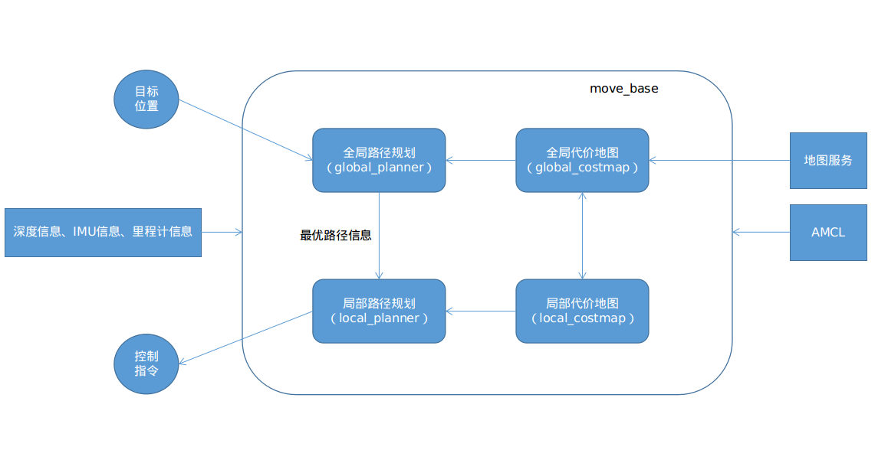

# navigation stack

### １.导航框架

xbot机器人完成导航，主要由定位和路径规划两个部分，ROS提供的两个功能包为AMCL和move_base。

下图为导航框架图：

该框架中，move_base提供主要的运行与交互接口，而精确定位部分，交给AMCL来处理。

### 2.模块分析

- 1.amcl是一种机器人在2D中移动的概率定位系统。 它实现了自适应（或KLD采样）蒙特卡罗定位方法（如Dieter Fox所述），该方法使用粒子滤波器来针对已知地图跟踪机器人的位姿。
- 2.base_local_planner使用Trajectory Rollout and Dynamic Window approaches来做平面上运动的机器人局部导航，控制器基于给定的路径规划和costmap生成速度命令后发送给移动基座。
- 3.carrot_planner试图找到适当的位置来使机器人跟随。规划器获取用户指定的目标位置，检查用户指定的位置是否在障碍区中。如果用户指定的位置在障碍区中，规划器就会在机器人与指定位置的已规划路径中寻找一个在障碍区外的可行的目标位置，然后再将此目标位置发送给局部规划器或者控制器
- 4.clear_costmap_recovery为导航堆栈提供了一种恢复行为，其尝试通过将导航堆栈使用的代价地图恢复到给定区域外的静态地图来清除空间。
- 5.costmap_2d提供了一种2D代价地图的实现方案，该方案从实际环境中获取传感器数据，构建数据的2D或3D占用栅格（取决于是否使用基于体素的实现），以及基于占用栅格和用户定义膨胀半径的2D代价地图的膨胀代价。costmap_2d-staticmap静态地图主要包含来自外部源的不变数据。costmap_2d-inflation为代价地图的代价值定义5个与机器人有关的标记：致命的（"Lethal" cost）、内切（"Inscribed" cost）、可能外切（"Possibly circumscribed" cost ）、自由空间（"Freespace" ）、未知（"Unknown"）
- 6.dwa_local_planner使用DWA（Dynamic Window Approach）算法实现了平面上移动机器人局部导航功能。（和base_local_planner什么关系？）
- 7.fake_localization用来替代定位系统，并且提供了amcl定位算法ROS API的子集。
- 8.global_planner为导航实现了一种快速，内插值的全局路径规划器， 继承了nav_core包中nav_core::BaseGlobalPlanner接口，该实现相比navfn使用更加灵活。
- 9.map_server提供了一个map_server ROS 节点, 该节点通过ROS 服务器方式提供地图数据。提供了map_saver命令行utility, 使用该工具可将动态创建的地图保存成文件。
- 10.move_base将全局路径和局部路径规划程序链接在一起，以完成其全局导航任务；维护两个costmaps，一个用于全局路径规划器，一个用于局部路径规划器,move_base_msgs 能够保留move_base包的操作描述和相关消息.
- 11.move_slow_and_clear是一种简单的修复机制，用来清除代价地图中信息并且限制机器人移动速度。（是一种简单的修复机制，用来清除代价地图中信息并且限制机器人移动速度。）
- 12.nav_core包含了导航功能包的关键接口。主要是：全局路径规划器、局部路径规划器、修复机制接口
- 13.navfn快速内插值的导航功能，用于为移动基座创建路径规划。假设机器人为圆形并利用代价地图来进行操作，以从栅格的起点到终点找到代价最小的路径规划；使用Dijkstra算法；在move_base中被作为全局路径规划器插件使用。
- 14.navigation——定义cmakelist
- 15.rotate_recovery给导航功能包提供了rotate_recovery::RotateRecovery修复机制，它尝试让机器人执行360度旋转来完成清理导航功能包里的代价地图的空间。
- 16.voxel_grid实现里高效的3D voxel grid（标记，自由或未知）

### 3. move_base

相关链接：[（ros/move_base）move介绍](https://blog.csdn.net/w383117613/article/details/46872497);

#### 参数列表

| 参数                      | 形参列表                | 作用含义                                                     |
| ------------------------- | ----------------------- | ------------------------------------------------------------ |
| conservative_reset_dist   | (double, default: 3.0)  | 从地图中清理空间时，距离机器人多少米远的障碍物会从成本地图中清除。这个参数只用在move_base的默认恢复行为中。 |
| recovery_behavior_enabled | (bool, default: true)   | 是否使能move_base的恢复行为来清理空间。                      |
| clearing_rotation_allowed | (bool, default: true)   | 清理空间时，确定机器人是否就地旋转。                         |
| shutdown_costmaps         | (bool, default: false)  | Move_base处于非活动状态时，确定是否关闭costmap节点。         |
| oscillation_timeout       | (double, default: 0.0)  | 执行恢复行为之前，允许振荡多少秒，seconds。                  |
| oscillation_distance      | (double, default: 0.5)  | 机器人必须移动多少米，才会认为不振荡。                       |
| planner_frequency         | (double, default: 0.0)  | 运行全局规划周期的频率，Hz。                                 |
| planner_patience          | (double, default: 5.0)  | 在空间清理操作操作执行之前，规划器将会等待多少秒来试图找到可行路径。 |
| controller_frequency      | (double, default: 20.0) | 运行控制周期，发送速度命令到基座的频率，Hz.                  |

#### 恢复行为参数

move_base中恢复行为（recovery_behaviors）参数列表：数据类型：`list`

| name               | type                                         |
| ------------------ | -------------------------------------------- |
| conservative_reset | clear_costmap_recovery/ClearCostmap/Recovery |
| rotate_recovery    | rotate_recovery/RotateRecovery               |
| aggressive_reset   | clear_costmap_recovery/ClearCostmap/Recovery |

### ４. Move_base代码框架

